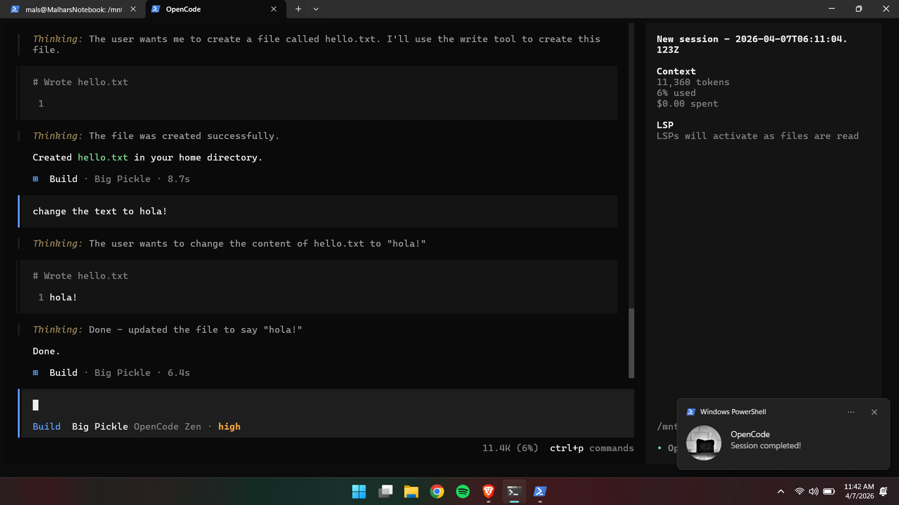
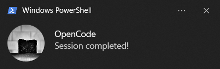

# 🔔 OpenCode WSL Notifications Plugin

Get **native Windows notifications** when using OpenCode inside **WSL (Windows Subsystem for Linux)**.

This plugin bridges the gap between Linux and Windows by triggering **Windows toast notifications** via `powershell.exe`.

---
## 📸 Preview




## ✨ Features

* 🔔 Native Windows toast notifications
* 🐧 Works seamlessly with WSL-based OpenCode
* ⚡ Alerts for:

  * Session completed
  * Session errors
  * Permission/input requests
* 🔊 Custom sound support (WAV / MP3)
* 🧠 Lightweight and easy to configure

---

## 🧠 How It Works

OpenCode runs inside **WSL (Linux)**, which cannot directly trigger Windows notifications.

This plugin solves that by:

1. Calling `powershell.exe` from WSL
2. Using the **BurntToast** PowerShell module
3. Displaying native Windows notifications

---

## ⚙️ Setup Guide

### 1️⃣ Install BurntToast (Windows)

Open **PowerShell as Administrator** and run:

```
Install-Module BurntToast -Force
```

Test installation:

```
New-BurntToastNotification -Text "OpenCode", "Test notification"
```

---

### 2️⃣ Create OpenCode Config (WSL)

Run in WSL:

```
mkdir -p ~/.config/opencode/plugins
```

---

### 3️⃣ Add Plugin Files

#### 📄 `~/.config/opencode/index.js`

```js
import notification from "./plugins/notification.js"

export default {
  plugins: [notification],
}
```

---

#### 📄 `~/.config/opencode/plugins/notification.js`

```js
export const NotificationPlugin = async ({ $ }) => {
  const notify = async (message) => {
    await $`powershell.exe -NoProfile -Command "
      Import-Module BurntToast;
      New-BurntToastNotification -Text 'OpenCode', '${message}'
    "`
  }

  const beep = async () => {
    await $`powershell.exe -NoProfile -Command "
      (New-Object Media.SoundPlayer 'C:\\Users\\YourName\\Music\\faaaah.wav').PlaySync()
    "`
  }

  return {
    event: async ({ event }) => {
      if (event.type === "session.idle") {
        await notify("Session completed!")
        await beep()
      }

      if (event.type === "session.error") {
        await notify("Session error!")
        await beep()
      }

      if (event.type === "permission.asked") {
        await notify("Waiting for input")
      }
    },
  }
}
```

---

### 4️⃣ Restart OpenCode

Close and reopen OpenCode after adding the plugin.

---

## 🔊 Custom Sound

To use your own sound:

1. Place a `.wav` file somewhere on Windows:

   ```
   C:\Users\YourName\Music\faaaah.wav
   ```

2. Update the path in `notification.js`

> ⚠️ Note: `.wav` is recommended for best compatibility

---

## 📂 Project Structure

```
~/.config/opencode
├── index.js
└── plugins
    └── notification.js
```

---

## 🚀 Example Workflow

1. Run OpenCode inside WSL
2. Ask it to perform a task
3. Switch tabs or continue working
4. Receive a Windows notification when done

---

## 📌 Why This Exists

WSL applications cannot directly trigger Windows notifications.

This plugin provides a simple and effective workaround using PowerShell bridging.

---

## 🛠 Future Improvements

* 📊 Show task summary in notification
* ⏱ Display execution time
* 🔕 Notification cooldown (prevent spam)
* 🎯 Per-project customization

---

## 🤝 Contributing

Feel free to open issues or submit PRs to improve this plugin!

---

## ⭐ Support

If this helped you, consider starring the repo ⭐
